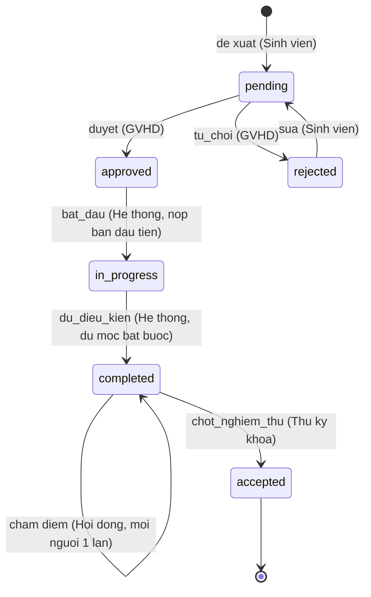

# Bản mã giả đã rà soát - Buổi 06
## Nhóm 03 - DT13 - Luồng nghiệp vụ thứ 3: Nghiệm thu cuối kỳ
### Người rà soát: Lê Thị Thúy Hằng (Nhóm trưởng)

> Trạng thái: ĐÃ CHỐT - đã đối chiếu với mã nguồn luồng 3 (gói V3 Buổi 06) và ràng buộc CSDL (gói V2 Buổi 06).

## 1. Bảng trạng thái (TRANSITIONS)

Dùng đúng các giá trị `trang_thai` đã có trong bảng `de_tai` (`pending`, `approved`, `rejected`, `in_progress`, `completed`), chỉ thêm một trạng thái cuối `accepted`. Bảng dưới là phần của luồng 3 trong `DeTaiService::CHUYEN_TRANG_THAI`:

| Trạng thái hiện tại | Hành động | Trạng thái kế tiếp | Vai trò được phép |
|---|---|---|---|
| `approved` (đã duyệt) | `bat_dau` (nhóm nộp bản báo cáo mốc đầu tiên) | `in_progress` (đang thực hiện) | Hệ thống, trong giao dịch nộp báo cáo |
| `in_progress` | `du_dieu_kien` (hệ thống kiểm tra đủ mốc bắt buộc) | `completed` (đủ điều kiện nghiệm thu) | Hệ thống, trong giao dịch GVHD duyệt báo cáo |
| `completed` | *(chấm điểm - không đổi trạng thái)* | `completed` | Hội đồng nghiệm thu, mỗi thành viên một lần |
| `completed` | `chot_nghiem_thu` (cần ít nhất 1 lượt chấm) | `accepted` (đã nghiệm thu) | Thư ký khoa |
| `accepted` | *(trạng thái cuối, không chuyển tiếp)* | — | — |

**Quy tắc bắt buộc:** chỉ đề tài đã có bản nộp **được GVHD duyệt** (`bao_cao_moc.trang_thai = 'approved'`) cho **toàn bộ mốc bắt buộc của lớp học phần** mới được hệ thống tự chuyển sang `completed`. Không có đường chuyển trạng thái nào bỏ qua bước này: hội đồng chỉ chấm khi đề tài `completed`, thư ký chỉ chốt từ `completed`.

**Vì sao không tách `mo_cham` / `dang_cho_cham` / `da_cham`:** UC06 cho phép nhiều thành viên hội đồng cùng chấm và lấy điểm trung bình. Nếu thành viên đầu tiên chấm làm đề tài sang `da_cham` thì các thành viên sau không còn chấm được. Vì vậy chấm điểm là thao tác ghi thêm vào `diem_nghiem_thu`, không đổi trạng thái; bước "mở chấm" của thư ký trùng với `completed` nên bỏ.

### Sơ đồ luồng trạng thái



## 2. Mã giả (theo khuôn mẫu Mục 6.4 - Khung T3)

```
HAM chamDiem(deTaiId, nguoiDung, duLieu):
    NEU duLieu.diem < 0 HOAC duLieu.diem > 10:
        TRA 422 "DIEM_NGOAI_KHOANG"
    MO giao dich
    deTai <- SELECT ... FROM de_tai WHERE id = deTaiId FOR UPDATE
    NEU deTai KHONG ton tai: HUY giao dich; TRA 404
    NEU KHONG coVaiTro(HOI_DONG, nguoiDung): HUY giao dich; TRA 403 "FORBIDDEN"
    NEU deTai.trang_thai <> 'completed': HUY giao dich; TRA 422 "INVALID_TRANSITION"
    NEU da co diem_nghiem_thu (deTaiId, nguoiDung.id): HUY giao dich; TRA 409 "CONFLICT"
    GHI vao bang diem_nghiem_thu (de_tai_id, hoi_dong_id: nguoiDung.id,
                                    diem: duLieu.diem, nhan_xet: duLieu.nhan_xet)
    GHI nhat_ky_he_thong (nguoiDung.id, 'GRADE_TOPIC', "Cham nghiem thu de tai ID: <id> - diem <d>")
    DONG giao dich
    TRA 201 kem so luot cham, diem trung binh

HAM chotNghiemThu(deTaiId, nguoiDung):
    MO giao dich
    deTai <- SELECT ... FROM de_tai WHERE id = deTaiId FOR UPDATE
    NEU deTai KHONG ton tai: HUY giao dich; TRA 404
    NEU KHONG coVaiTro(THU_KY_KHOA, nguoiDung): HUY giao dich; TRA 403 "FORBIDDEN"

    trangThaiMoi <- TRANSITIONS[deTai.trang_thai]['chot_nghiem_thu']
    NEU trangThaiMoi KHONG xac dinh: HUY giao dich; TRA 422 "INVALID_TRANSITION"

    (soLuot, diemTB) <- COUNT(*), ROUND(AVG(diem), 2) FROM diem_nghiem_thu WHERE de_tai_id = deTaiId
    NEU soLuot < 1: HUY giao dich; TRA 422 "CHUA_CO_DIEM"

    CAP NHAT de_tai SET trang_thai = trangThaiMoi WHERE id = deTaiId
    GHI nhat_ky_he_thong (nguoiDung.id, 'ACCEPT_TOPIC',
                            "Chot nghiem thu de tai ID: <id> - diem TB <diemTB> (<soLuot> luot cham)")
    GHI thong_bao cho nhom truong va GVHD
    DONG giao dich
    TRA 200 kem de tai, so luot cham, diem trung binh
```

Hai hàm cùng khóa dòng `de_tai`, nên lượt chấm gửi sau khi đã chốt sẽ thấy `accepted` và bị từ chối; lệnh chốt luôn thấy đủ các lượt chấm ghi trước nó. Bảng `nhat_ky_he_thong` không có cột "từ/đến" riêng: trạng thái trước và sau suy ra từ mã hành động (bảng ánh xạ trong `DeTaiService::lichSu`).

### Logic chuyển trạng thái tự động (khi nào kiểm tra "đủ điều kiện")

Áp dụng đúng nguyên tắc "phương án chính + phương án dự phòng" như Khung T1 (Mục 6.2 tài liệu kỹ thuật), vì Nhánh A (InfinityFree) không có quyền chạy tiến trình nền (cron) tùy ý trên máy chủ.

**Phương án chính - kích hoạt theo sự kiện (event-driven), không cần cron:**
Gắn trực tiếp vào API `POST /api/v1/bao-cao-moc/{id}/duyet`. Ngay sau khi Service cập nhật báo cáo mốc sang `approved`, gọi `kiemTraDuDieuKien(deTai)` **trong cùng giao dịch**. Nếu đủ điều kiện, chuyển đề tài sang `completed` ngay. Tương tự, API nộp báo cáo `POST /api/v1/de-tai/{id}/bao-cao-moc` chuyển đề tài `approved → in_progress` trong cùng giao dịch ghi bản nộp.

```
// Trong ham duyet bao cao (BaoCaoMocService::xuLyBoiGvhd)
MO giao dich
deTai  <- khoa dong de tai cua bao cao (FOR UPDATE)     // khoa de tai TRUOC
baoCao <- khoa dong bao cao (FOR UPDATE)                 // roi moi khoa bao cao
... duyet bao cao: pending -> approved, ghi APPROVE_REPORT ...
NEU deTai.trang_thai = 'in_progress' VA kiemTraDuDieuKien(deTai):
    CAP NHAT de_tai SET trang_thai = TRANSITIONS['in_progress']['du_dieu_kien']   // completed
    GHI nhat_ky_he_thong (GVHD duyet, 'TOPIC_READY', "De tai ID: <id> du dieu kien nghiem thu")
    GHI thong_bao cho nhom truong
DONG giao dich
```

Nộp báo cáo cũng khóa đề tài trước rồi mới đọc bản nộp, nên hai giao dịch luôn khóa theo cùng thứ tự và không chờ nhau vòng tròn.

**Phương án dự phòng - không làm:**
Bản nháp đề xuất cho `GET /api/v1/nghiem-thu/ho-so` chạy lại `kiemTraDuDieuKien()` khi đọc. Nhóm không làm vì: (1) chuyển trạng thái nằm trong **cùng giao dịch** với thao tác duyệt nên không thể "chưa kịp cập nhật" - giao dịch hỏng thì cả hai cùng hủy; (2) một lệnh GET sẽ phải ghi dữ liệu và ghi nhật ký, trái quy ước GET chỉ đọc; (3) dữ liệu sửa thẳng trong CSDL đã có ràng buộc CHECK và (trên máy) trigger `trg_detai_chuyen_trangthai` chặn. Nếu cần sửa dữ liệu lệch, chạy truy vấn đối soát B4, B5 trong `doi_soat.sql` của V2.

## 3. Thuật toán đặc thù liên quan: kiểm tra đủ điều kiện nghiệm thu

```
HAM kiemTraDuDieuKien(deTai):
    lop <- deTai.lop_hoc_phan_id
    tongMoc <- COUNT(*) FROM moc_thoi_gian
                WHERE lop_hoc_phan_id = lop AND bat_buoc = 1
    mocDaDuyet <- COUNT(DISTINCT b.moc_thoi_gian_id)
                   FROM bao_cao_moc b JOIN moc_thoi_gian m ON m.id = b.moc_thoi_gian_id
                   WHERE b.de_tai_id = deTai.id AND b.trang_thai = 'approved'
                     AND m.bat_buoc = 1 AND m.lop_hoc_phan_id = lop

    TRA (tongMoc > 0 VA mocDaDuyet >= tongMoc)
```

So với bản nháp: (1) chỉ đếm mốc **của lớp học phần chứa đề tài** - bản nháp đếm mốc bắt buộc của mọi lớp nên không đề tài nào đủ; (2) `COUNT(DISTINCT moc)` vì một mốc có thể có nhiều bản nộp (nộp lại tạo bản ghi mới); (3) lớp chưa có mốc bắt buộc nào thì **không** tự đủ điều kiện (bản nháp ra `0 = 0` là đúng). Hàm nằm ở `MocThoiGianRepository::demBatBuoc` và `BaoCaoMocRepository::demMocBatBuocDaDuyet`.

## 4. Ràng buộc bảo vệ bất biến nghiệp vụ ở mức CSDL (phối hợp với V2)

```sql
-- Da co san trong schema.sql: diem nghiem thu luon trong khoang hop le
--   CONSTRAINT chk_diem_khoangdiem CHECK (diem >= 0 AND diem <= 10)

-- cap_nhat_csdl_buoi6.sql (V2): moi thanh vien hoi dong chi cham 1 lan cho moi de tai
ALTER TABLE diem_nghiem_thu
    ADD CONSTRAINT uq_diem_detai_hoidong UNIQUE (de_tai_id, hoi_dong_id);

-- cap_nhat_csdl_buoi6.sql (V2): them trang thai cuoi 'accepted'
ALTER TABLE de_tai DROP CONSTRAINT chk_detai_trangthai;
ALTER TABLE de_tai ADD CONSTRAINT chk_detai_trangthai
    CHECK (trang_thai IN ('pending','approved','rejected','in_progress','completed','accepted'));

-- Bang chuyen trang thai hop le (trigger trg_detai_chuyen_trangthai doc bang nay)
INSERT INTO chuyen_trang_thai_hop_le (doi_tuong, tu_trang_thai, den_trang_thai) VALUES
    ('de_tai','approved','in_progress'),
    ('de_tai','in_progress','completed'),
    ('de_tai','completed','accepted');
```

InfinityFree không cho tạo trigger (`#1142 TRIGGER command denied`), nên trên web chỉ có CHECK và UNIQUE; trigger chạy trên máy cục bộ. Ở tầng ứng dụng, Service vẫn kiểm tra trước (trả 409 / 422) và khóa dòng đề tài, nên ràng buộc CSDL là lớp chặn cuối.

## 5. Kết quả đối chiếu với mã nguồn thực tế

| Mục đối chiếu | Khớp mã giả? | Ghi chú / điều chỉnh |
|---|---|---|
| Bảng TRANSITIONS trong code | Khớp (sau khi chỉnh) | `DeTaiService::CHUYEN_TRANG_THAI` có `approved→in_progress→completed→accepted`; dùng trạng thái sẵn có của bảng `de_tai`, bỏ `mo_cham`/`dang_cho_cham`/`da_cham` (lý do ở Mục 1). Unit test dùng đúng bảng này, 8/8 đạt |
| Kiểm tra quyền theo từng hành động | Khớp | Bộ lọc `PhanQuyenFilter` theo mã chức năng F4.1–F4.5 (F4.5 mới cho thư ký); Service kiểm vai trò và phạm vi đối tượng: GVHD chấm 403, hội đồng chốt 403, GV/SV ngoài nhóm xem điểm 403 |
| Mở giao dịch cho thao tác ghi điểm | Khớp | Chấm và chốt đều khóa dòng `de_tai` bằng `FOR UPDATE`. 10 yêu cầu chấm cùng lúc của một thành viên: 1×201 + 9×409, đúng 1 dòng điểm |
| Ghi nhật ký hệ thống | Khớp (đổi tên hành động) | `START_TOPIC`, `TOPIC_READY`, `GRADE_TOPIC`, `ACCEPT_TOPIC` thay cho `NGHIEM_THU_*` / `TU_DONG_DU_DIEU_KIEN`, theo quy ước tên tiếng Anh của các hành động sẵn có; lịch sử đề tài hiện đủ `pending → approved → in_progress → completed → accepted` |
| Ràng buộc CHECK ở CSDL | Khớp | `chk_diem_khoangdiem` đã có sẵn; `uq_diem_detai_hoidong` và `chk_detai_trangthai` (thêm `accepted`) ở `cap_nhat_csdl_buoi6.sql`; thử ghi điểm 11 bị chặn `#4025` |

*Người rà soát: Lê Thị Thúy Hằng - Nhóm trưởng*
